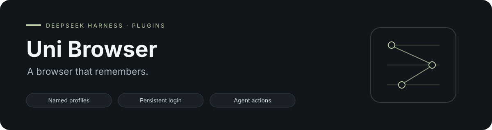

<div align="center">



# DSH Uni Browser

[English](README.md) · [简体中文](README.zh.md)

[](https://www.npmjs.com/package/dsh-uni-browser) [](LICENSE) [](https://github.com/topics/dsh-plugin)

</div>

为 DSH Agent 提供有名字、能保留本地登录状态的浏览器配置。先打开可见浏览器自行登录，之后的 Agent 任务继续复用同一配置。

## 保留浏览器上下文

| 能力 | 行为 |
| --- | --- |
| **命名配置** | 独立的 Chromium 或 Camoufox 配置，支持中文等 Unicode 名称。 |
| **持久登录** | 复用本地 cookies、localStorage 和 IndexedDB。 |
| **Agent 操作** | 通过 uni-browser action API 导航、快照、点击、输入和按键。 |
| **托管运行时** | 按需启动本机私有 daemon。 |
| **明确操作** | 打开和停止保留状态，忘记配置需确认后才删除。 |

## 快速开始

```bash
dsh plugin --profile web add dsh-uni-browser@latest
dsh web
```

1. 打开 **设置 → Uni Browser** 并创建配置。
2. 需要登录的配置保持 **headless 关闭**。
3. 点击 **打开**，在可见浏览器中自行完成登录。
4. 让 Agent 在浏览器任务中使用这个配置。

设置页支持中英文与 DSH 主题，区分加载中、空列表、运行状态和操作失败。中文等 Unicode 名称保留显示标签，并获得稳定的内部标识。

## Agent 工具

| 工具 | 用途 |
| --- | --- |
| `uni_browser_profiles` | 列出配置和运行状态。 |
| `uni_browser_profile_create` | 创建命名配置。 |
| `uni_browser_open` / `uni_browser_close` | 启停浏览器，保留本地状态。 |
| `uni_browser_forget` | 明确确认后删除配置。 |
| `uni_browser_navigate` / `uni_browser_snapshot` | 导航并读取无障碍快照。 |
| `uni_browser_click` / `uni_browser_type` / `uni_browser_press` | 操作选中的配置。 |

## 运行时与浏览器引擎

npm 会按平台安装 **uni-browser daemon**，支持 macOS ARM64/x64 和 Linux ARM64/x64。daemon 启动在 `$DSH_HOME/dsh-uni-browser/daemon` 下，通过私有 Unix socket 通信。

默认复用已经安装的 Chrome/Chromium。使用 Camoufox 时，通过 `UNI_BROWSER_CAMOUFOX_BIN` 提供其可执行文件；运行时包不负责安装浏览器引擎。

| 环境变量 | 用途 |
| --- | --- |
| `UNI_BROWSER_SOCKET` | 使用外部管理的 daemon。 |
| `UNI_BROWSER_BIN` | 指定 daemon 可执行文件。 |
| `UNI_BROWSER_CHROMIUM_BIN` | 指定 Chromium/Chrome 可执行文件。 |
| `UNI_BROWSER_CAMOUFOX_BIN` | 指定 Camoufox 可执行文件。 |

如果安装时忽略了 optional dependencies，需要提供 daemon socket 或可执行文件。预编译运行时暂不覆盖 Windows。

## 状态与生命周期

**停止**会保留配置目录；**忘记配置**经确认后永久删除 cookies、local storage、IndexedDB 和其他本地登录状态。

插件卸载时只停止自己启动的 daemon，外部管理的 daemon 保持不变。操作通过 uni-browser 可审计的 NDJSON API，不直接透传底层浏览器调试协议。密码和 cookies 不作为配置或工具参数传递。

## 维护者文档

[发布与运行时指南](docs/releasing.md) 说明平台包版本固定、校验和验证与发布顺序。插件和运行时独立演进，上游发布不会改变已经发布的插件版本。

## 开发与反馈

```bash
npm ci
npm run check
```

[提交问题](https://github.com/baixianger/dsh-uni-browser/issues) · [版本记录](RELEASES.md) · [MIT 许可证](LICENSE)
